# LLM Probability Calibration — Results Report

> Last updated: 2026-04-28

## Overview

We probe how LLMs behave when asked to output probability estimates (0–100%) by extracting the **full softmax distribution over all integer tokens** at the answer position — going beyond top-1 greedy decoding. Two conditions swap the elicitation order of probability (P) and confidence (C) to measure anchoring/order effects.

**Models evaluated:**
- `Qwen/Qwen3-8B` — 496 questions (Tier 1: 215, Tier 2: 200, Tier 3: 81)
- `google/gemma-3-12b-it` — 406 questions (Tier 1: 215, Tier 2: 191)

**Key findings preview:**
- Both models are **poorly calibrated** (MAE ~34–35 on Tier 1/2) — near chance
- Neither model shows round-number attractor bias at the logit level (both *below* random expectation for multiples of 10)
- Entropy is significantly **higher in Condition B** (C-first) than Condition A (P-first) — asking for confidence first makes the subsequent probability estimate more diffuse
- Gemma has substantially larger order effects than Qwen3 (mean P-KL: 1.50 vs 0.66 nats)
- P distributions are often **multimodal** — the model simultaneously hedges across multiple plausible ranges

---

## 1. Per-Question Distribution Examples

Each figure below shows the logit-level probability distribution over all integers 0–100 at the answer position. Each 2×2 panel shows:
- **Top row**: Condition A (P-first elicitation)
- **Bottom row**: Condition B (C-first elicitation)
- **Left column**: P distribution (model's probability estimate)
- **Right column**: C distribution (model's stated confidence)
- 🔴 Red bar/line = argmax; 🟢 Green dashed line = ground truth (when available)

### 1.1 Qwen3-8B — Selected Examples

#### Gallery Overview (P distribution, Condition A)

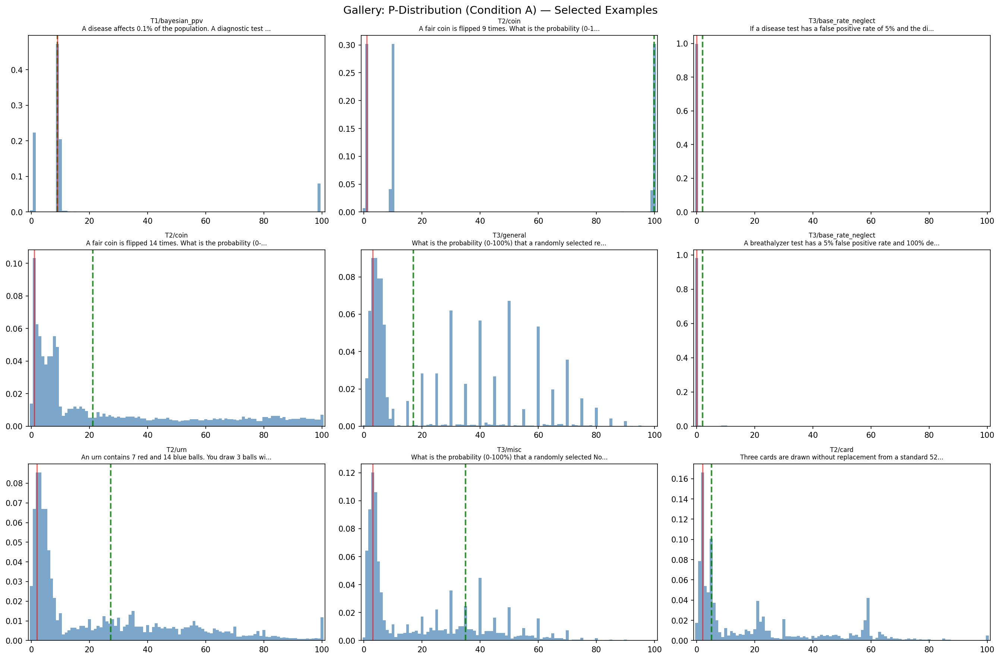

---

#### Example 1 — Well-Calibrated (Bayesian PPV)
**Question:** *"A disease affects 0.1% of the population. A diagnostic test has 99% sensitivity and 99% specificity. A randomly selected person tests positive. What is the probability (0-100%) that they actually have the disease?"*

Ground truth: **9.02%** | P argmax (Cond A): **9** | P entropy: **1.92 bits** | Modes: 3

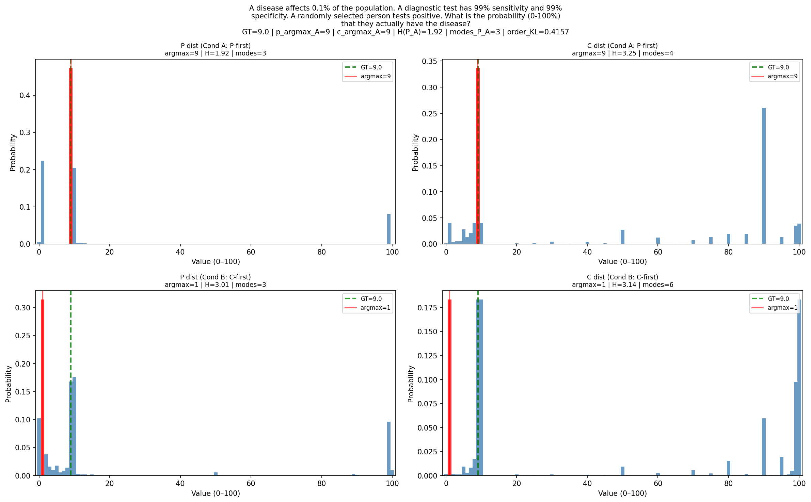

> 🟢 **Peaked and correct.** Qwen3-8B gets the Bayesian base-rate computation right: its distribution concentrates tightly around 9, which matches the ground truth. Low entropy, few modes. Note condition B shifts to 1 — asking for confidence first degrades the probability estimate significantly.

---

#### Example 2 — Badly Miscalibrated (Coin)
**Question:** *"A fair coin is flipped 9 times. What is the probability (0-100%) that heads appears at least 1 times?"*

Ground truth: **99.8%** | P argmax (Cond A): **1** | P error: **98.8** | P entropy: **2.07 bits** | Modes: 3

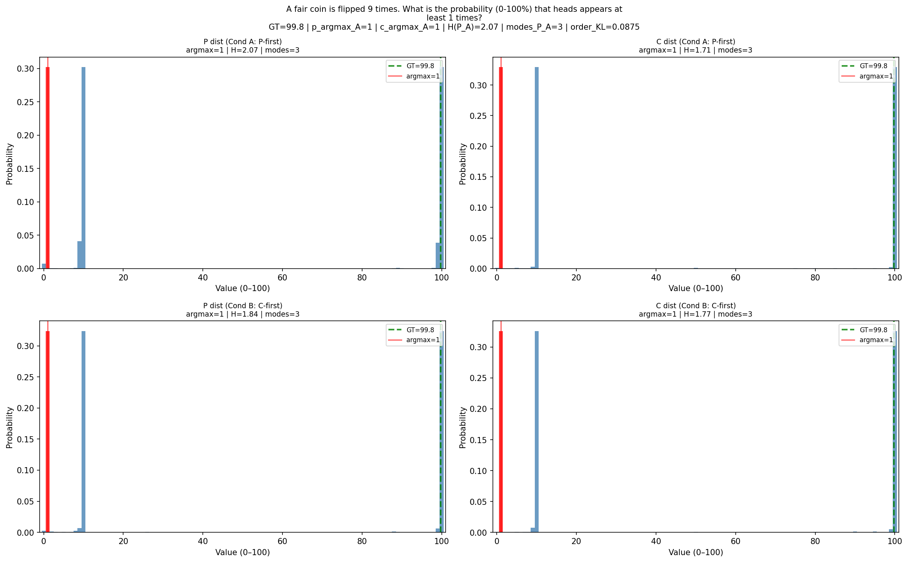

> 🔴 **Confidently wrong.** The correct answer is ~99.8%, but the model outputs a sharp distribution near 1. This is a near-certain event that the model treats as near-impossible. Low entropy means it's *confident* in its wrong answer.

---

#### Example 3 — Very Peaked + Strong Order Effect (Base-Rate Neglect)
**Question:** *"If a disease test has a false positive rate of 5% and the disease prevalence is 1 in 1000, and you test positive, what is the probability (0-100%) that you actually have the disease?"*

Ground truth: **2.0%** | P argmax (Cond A): **0** | P entropy: **0.031 bits** | Order KL: **1.508**

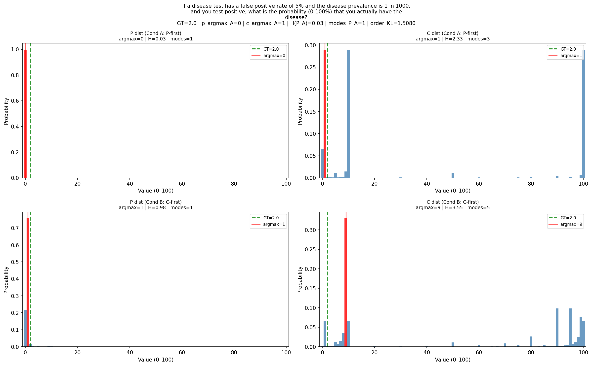

> ⚡ **Extreme peaking with elicitation sensitivity.** The P distribution in Cond A is essentially a delta function at 0 (entropy = 0.031, near minimum possible). But Cond B shifts argmax to 1 with a completely different distribution shape — strong evidence that elicitation order anchors the model.

---

#### Example 4 — Highly Diffuse + Multimodal (Coin)
**Question:** *"A fair coin is flipped 14 times. What is the probability (0-100%) that heads appears at least 9 times?"*

Ground truth: **21.2%** | P argmax (Cond A): **1** | P entropy: **5.79 bits** | Modes: **6**

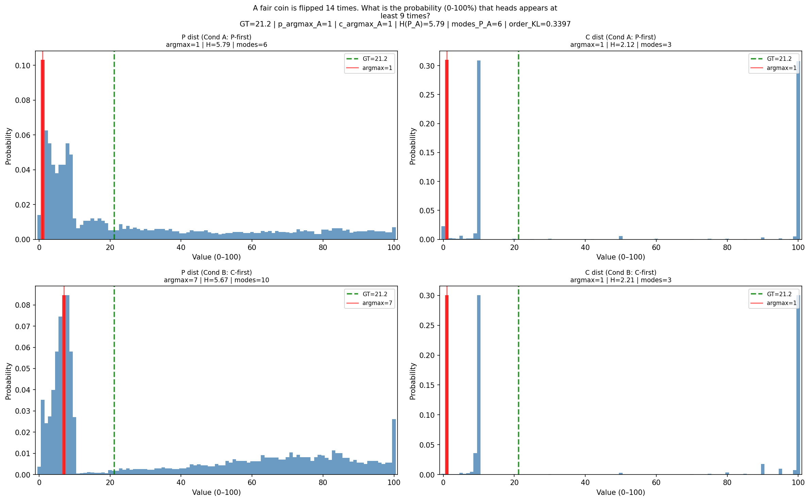

> 🌊 **High uncertainty, multimodal.** The distribution spreads mass across 6 distinct modes. The model is genuinely uncertain — not just picking a number, but hedging across multiple plausible ranges simultaneously. Entropy of 5.79 is near the maximum for a discrete distribution over 101 values (~6.66 bits).

---

#### Example 5 — Multimodal with 18 Modes (Epistemic)
**Question:** *"What is the probability (0-100%) that a randomly selected restaurant in the US closes within its first year?"*

P argmax (Cond A): **3** | P entropy: **4.56 bits** | Modes: **18**

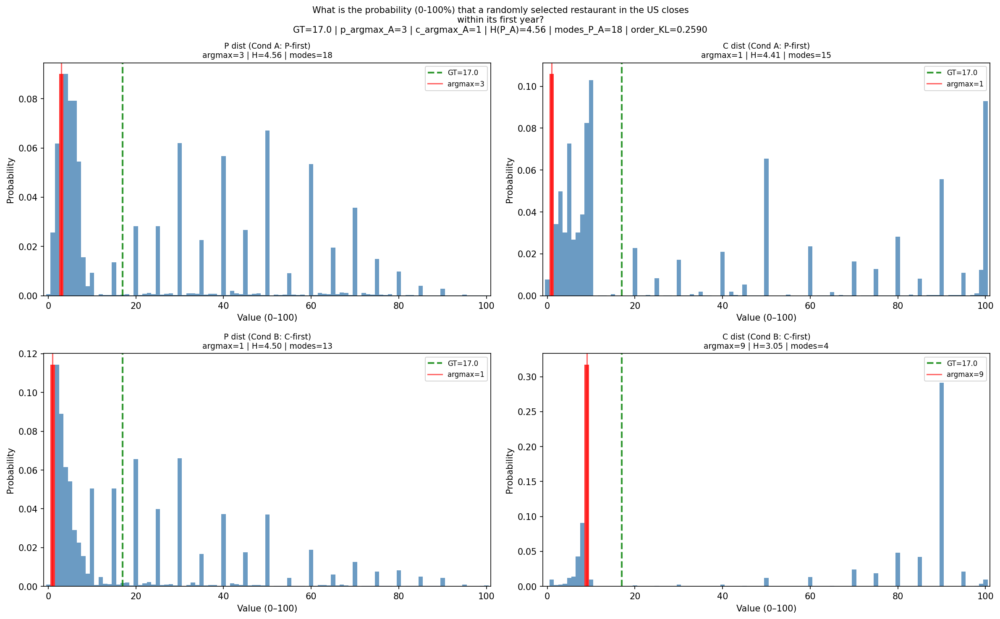

> 🌐 **Near-uniform spread for uncertain epistemic facts.** With 18 modes and high entropy, the model places meaningful mass across a huge range. No single answer dominates. This is the distribution signature of epistemic questions where the model has conflicting training signal.

---

#### Example 6 — Strongest Order Effect (Base-Rate Neglect)
**Question:** *"A breathalyzer test has a 5% false positive rate and 100% detection rate for drunk drivers. If 1 in 1000 drivers on the road is drunk, and the test says a driver is drunk, what is the probability (0-100%) they actually are?"*

Ground truth: **2.0%** | P argmax (Cond A): **0** | Order KL: **5.165** (highest in dataset)

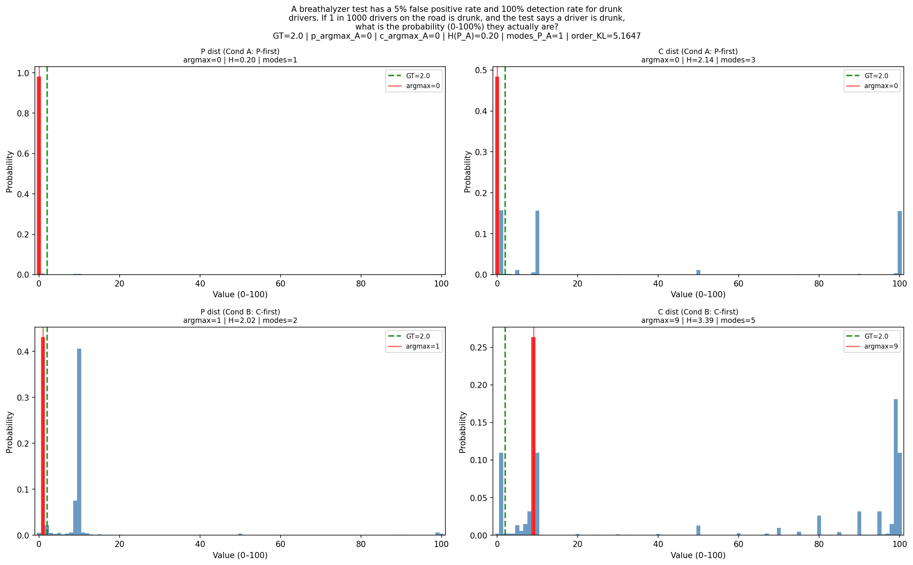

> 💥 **Largest order effect in the Qwen3-8B dataset (KL=5.165 nats).** Condition A gives a delta-like spike near 0; Condition B produces an entirely different distribution spread across mid-range values. Asking for confidence first completely reframes the model's probability estimate.

---

#### Examples 7–9

Example 7 — Urn (multimodal, 12 modes)

**Question:** *"An urn contains 7 red and 14 blue balls. You draw 3 balls without replacement. What is the probability (0-100%) that exactly 0 are red?"*

Ground truth: **27.37%** | P argmax (Cond A): **2** | Entropy: **5.65 bits** | Modes: **12**

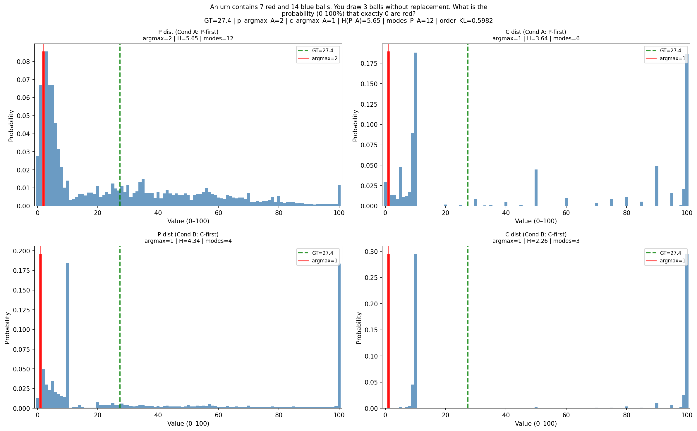

Example 8 — Misc Epistemic (diffuse)

**Question:** *"What is the probability (0-100%) that a randomly selected Nobel Prize winner is from the United States?"*

Ground truth: **35%** | P argmax (Cond A): **3** | Entropy: **5.15 bits** | Modes: **9**

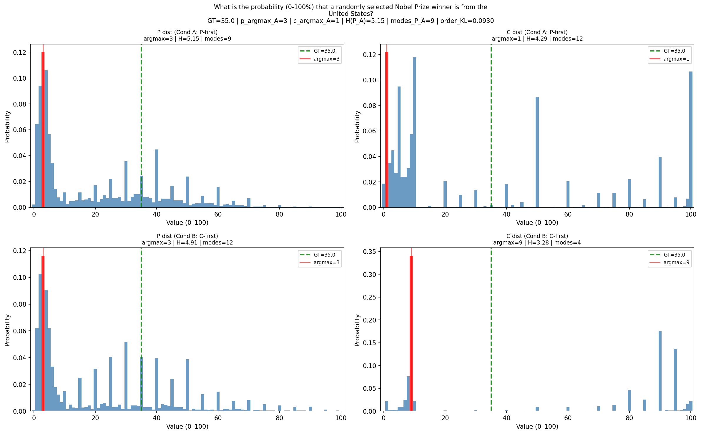

Example 9 — Cards (multimodal)

**Question:** *"Three cards are drawn without replacement from a standard 52-card deck. What is the probability (0-100%) that all three are the same suit?"*

Ground truth: **5.18%** | P argmax (Cond A): **2** | Entropy: **5.11 bits** | Modes: **6**

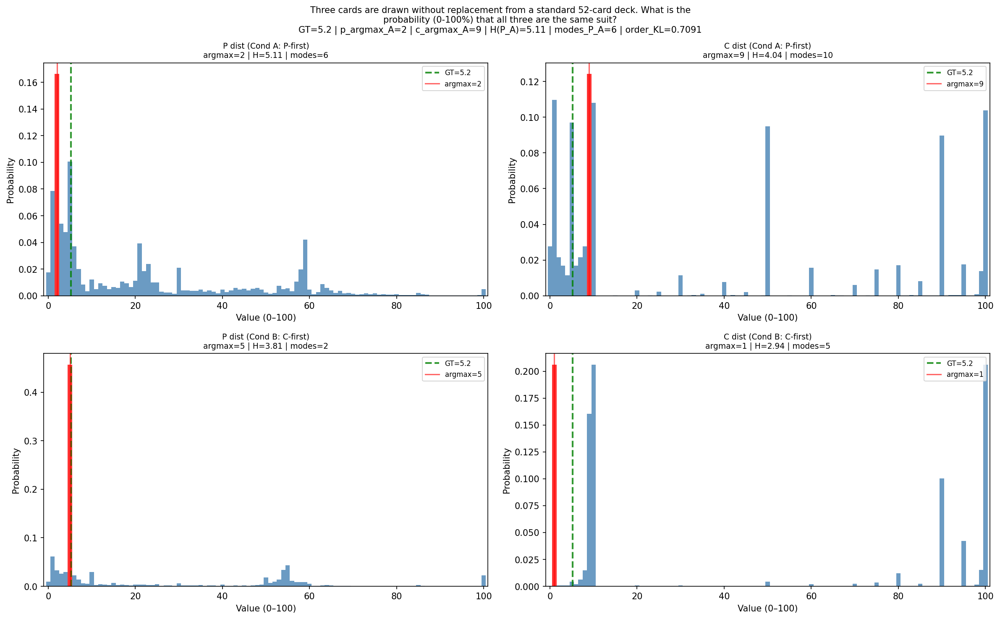

---

### 1.2 Gemma-3-12B — Selected Examples

#### Gallery Overview (P distribution, Condition A)

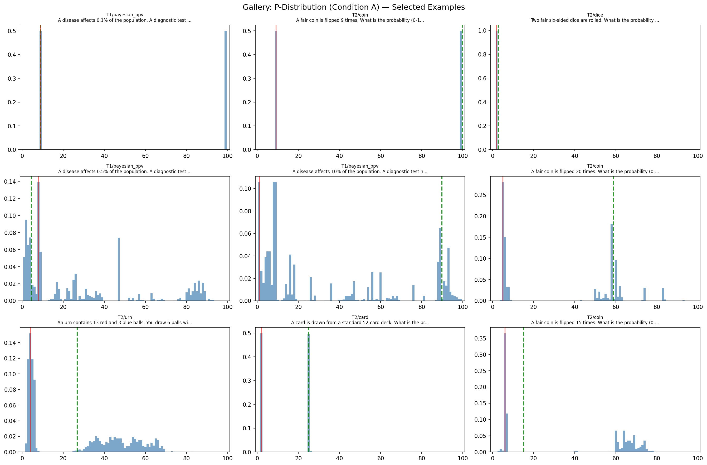

---

#### Example 1 — Well-Calibrated (Bayesian PPV)
**Question:** *"A disease affects 0.1% of the population. A diagnostic test has 99% sensitivity and 99% specificity. A randomly selected person tests positive. What is the probability (0-100%) that they actually have the disease?"*

Ground truth: **9.02%** | P argmax (Cond A): **9** | P entropy: **1.01 bits** | Modes: 2

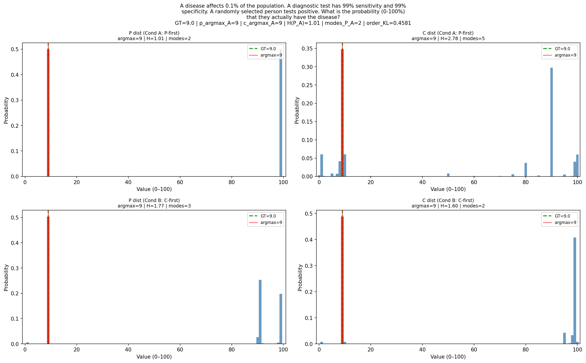

> 🟢 **Very sharp and correct.** Gemma's distribution is even more peaked than Qwen3's for this question (entropy 1.01 vs 1.92 bits). Both conditions agree on argmax=9. Narrower uncertainty, same correct answer.

---

#### Example 2 — Badly Miscalibrated (Coin)
**Question:** *"A fair coin is flipped 9 times. What is the probability (0-100%) that heads appears at least 1 times?"*

Ground truth: **99.8%** | P argmax (Cond A): **9** | P error: **90.8** | P entropy: **1.02 bits**

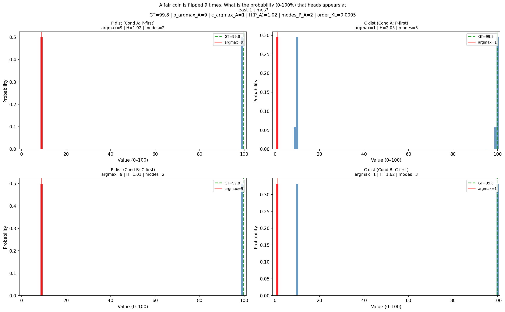

> 🔴 **Confidently wrong, different failure mode.** Unlike Qwen3-8B which predicted 1, Gemma predicts 9 — also wrong, but in a different direction. Both models are miscalibrated on this near-certain coin flip, with low-entropy (confident) wrong distributions.

---

#### Example 3 — Very Peaked + Strong Order Effect (Dice)
**Question:** *"Two fair six-sided dice are rolled. What is the probability (0-100%) that the sum is exactly 2?"*

Ground truth: **2.78%** | P argmax (Cond A): **2** | P entropy: **0.044 bits** | Order KL: **1.110**

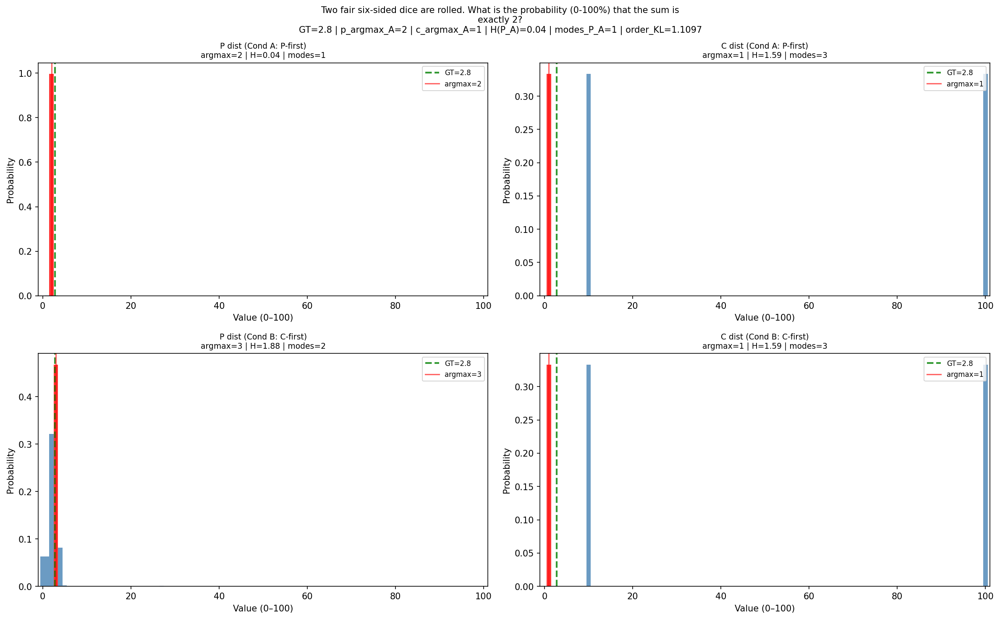

> ⚡ **Sharp and nearly correct (2 vs 2.78%), but condition B shifts to 3.** Interesting: the model almost exactly gets the right answer in Cond A, but elicitation order moves it by 1 unit. This is a case where order effect introduces small but nonzero error on an otherwise well-calibrated response.

---

#### Example 4 — Highly Diffuse + Multimodal + Strong Order Effect (Bayesian PPV)
**Question:** *"A disease affects 0.5% of the population. A diagnostic test has 95% sensitivity and 90% specificity. A randomly selected person tests positive. What is the probability (0-100%) that they actually have the disease?"*

Ground truth: **4.56%** | P argmax (Cond A): **8** | Entropy: **4.86 bits** | Modes: **12** | Order KL: **1.321**

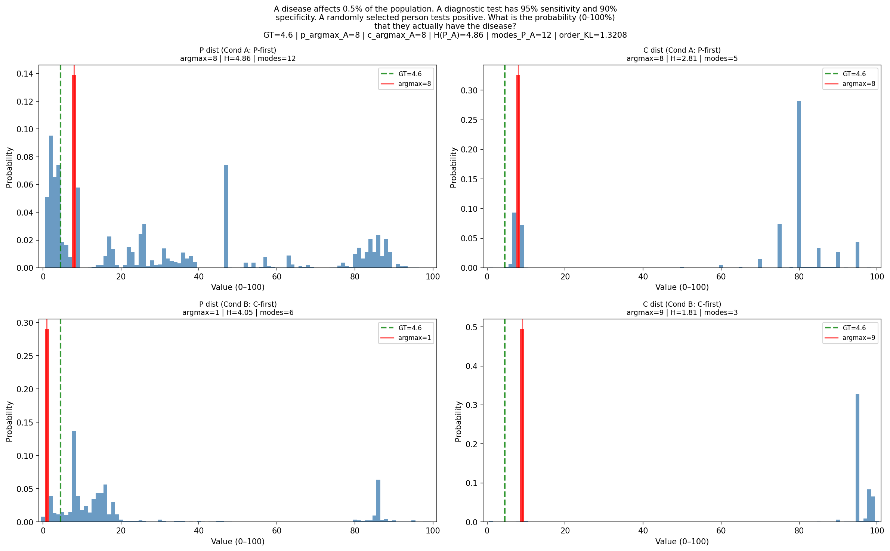

> 🌊 **All three failure modes at once.** High entropy, high multimodality, strong order effect. The model spreads mass across 12 distinct peaks, and the P distribution restructures completely when elicitation order changes.

---

#### Example 5 — Badly Miscalibrated + High Entropy + Strong Order Effect (Bayesian)
**Question:** *"A disease affects 10% of the population. A diagnostic test has 80% sensitivity and 99% specificity. A randomly selected person tests positive. What is the probability (0-100%) that they actually have the disease?"*

Ground truth: **89.89%** | P argmax (Cond A): **1** | Error: **88.89** | Entropy: **4.78 bits** | Modes: **18** | Order KL: **1.527**

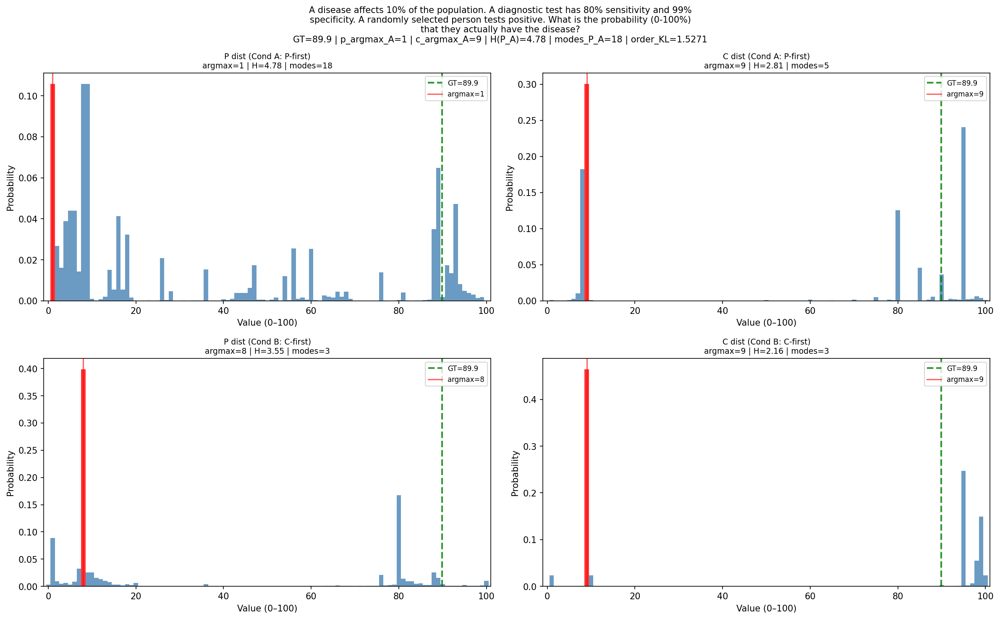

> 🔴 **Worst case.** Ground truth is ~90%, model predicts ~1%. 18 modes, diffuse distribution, massive error, large order effect. The model has no useful signal on high-prevalence Bayesian problems — just spreads mass uniformly while anchoring near 0.

---

Examples 6–9 (Gemma)

**Example 6 — Coin (Cond A: 5, Cond B: 9)**

*"A fair coin is flipped 20 times. What is the probability (0-100%) that heads appears at least 10 times?"* Ground truth: 58.81%

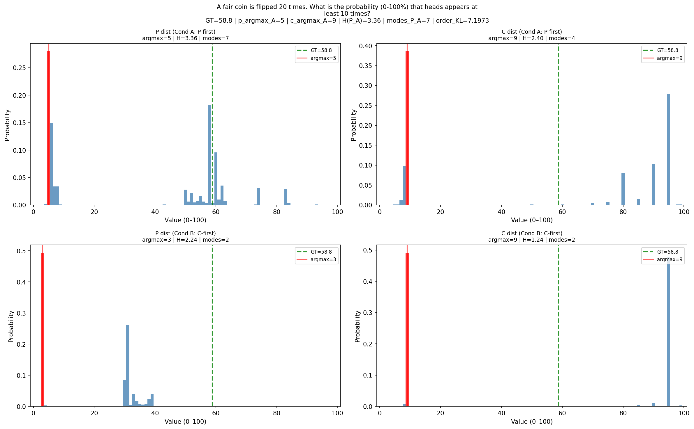

**Example 7 — Urn (multimodal)**

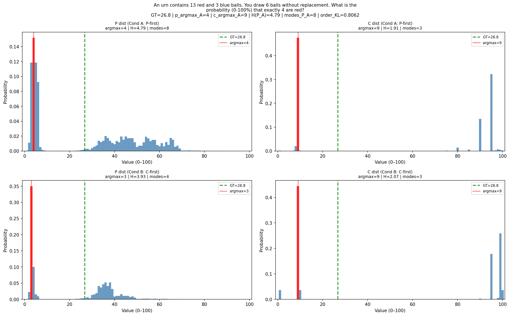

**Example 8 — Card**

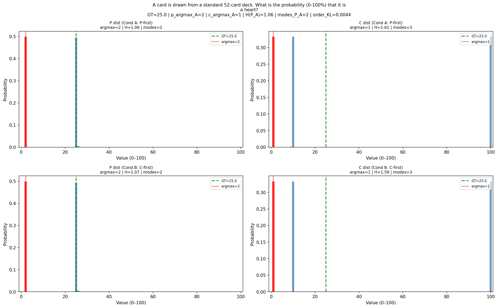

**Example 9 — Coin**

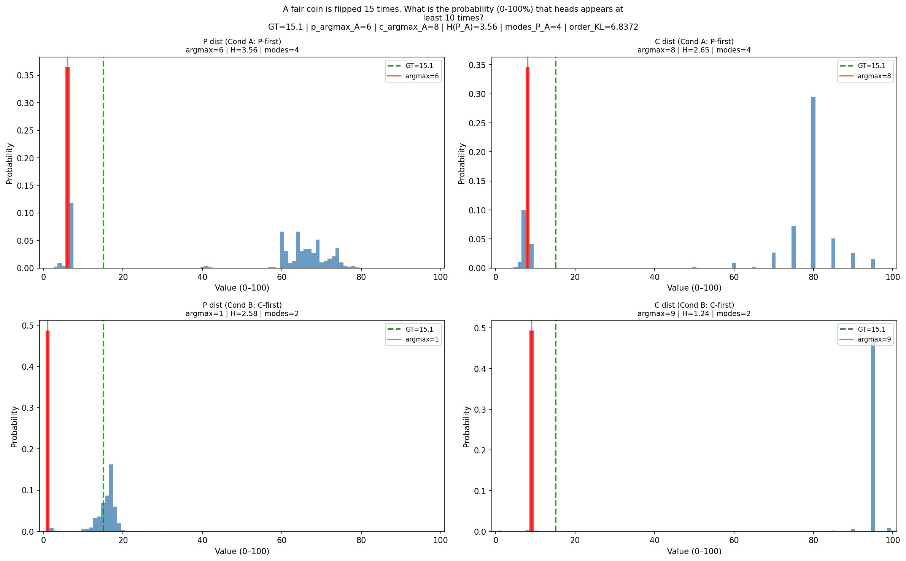

---

## 2. Aggregate Analysis

### 2.1 Entropy Distributions

The entropy histograms show how concentrated vs. diffuse the logit distributions are across all questions.

#### Qwen3-8B

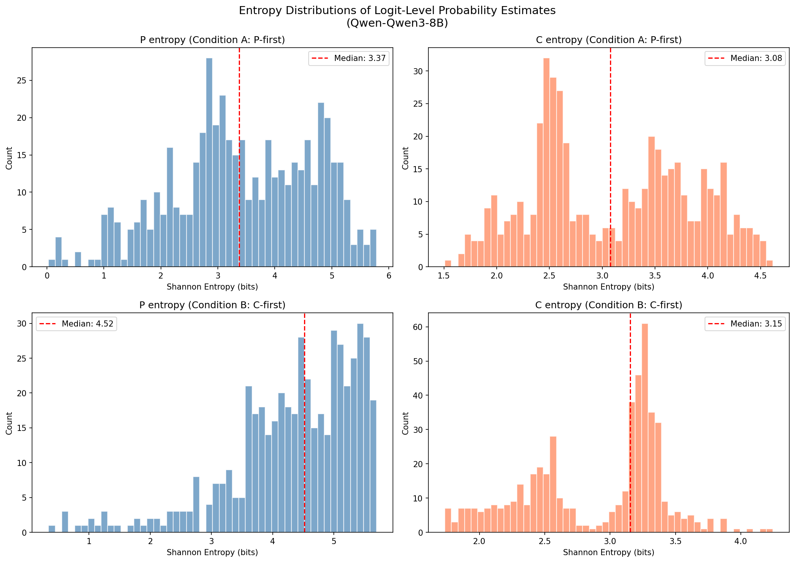

| Metric | Cond A (P-first) | Cond B (C-first) |
|--------|-------------------|-------------------|
| P entropy (mean) | 3.43 bits | 4.35 bits |
| P entropy (median) | 3.37 bits | 4.52 bits |
| C entropy (mean) | 3.10 bits | 2.89 bits |

> **Key observation:** P entropy increases substantially when going from Cond A → Cond B (+0.92 bits mean). Asking for confidence first makes the model more diffuse/uncertain in its subsequent probability estimate. The C distribution entropy is slightly lower in Cond B — when asked for confidence first, the model is somewhat more decisive about its confidence level.

#### Gemma-3-12B

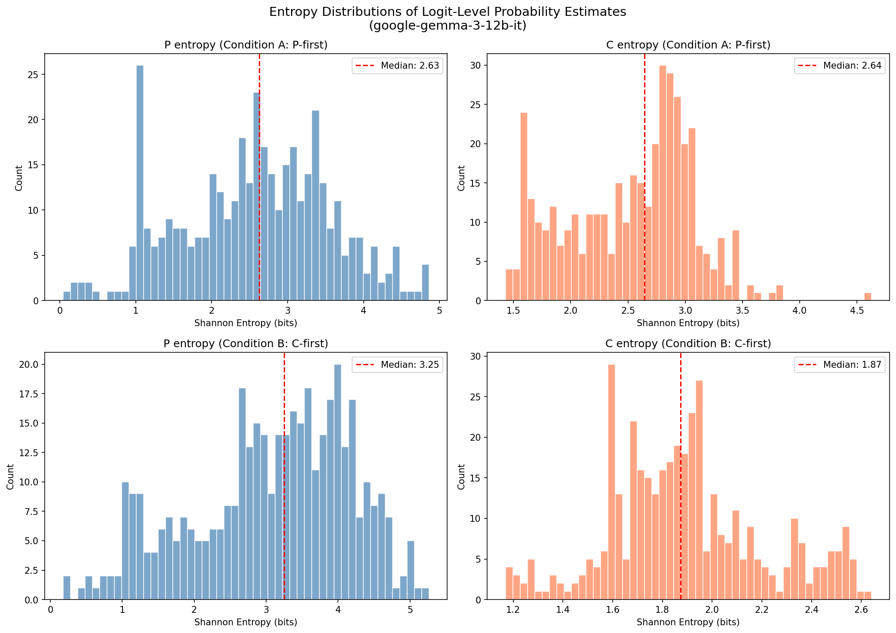

| Metric | Cond A (P-first) | Cond B (C-first) |
|--------|-------------------|-------------------|
| P entropy (mean) | 2.56 bits | 3.08 bits |
| P entropy (median) | 2.63 bits | 3.25 bits |
| C entropy (mean) | 2.52 bits | 1.89 bits |

> **Gemma is more decisive** than Qwen3 overall (lower entropy across both conditions). Its confidence entropy in Cond B is markedly lower (1.89 vs 3.10 for Qwen3), suggesting Gemma's confidence outputs are more peaked when asked first.

---

### 2.2 Calibration Curves

Reliability diagrams for Tier 1 & 2 (questions with exact ground truth).

#### Qwen3-8B

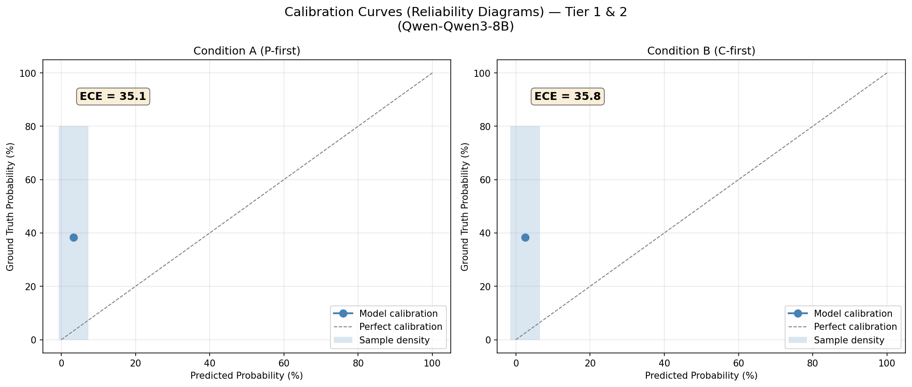

**MAE (Cond A):** 35.37 | **MAE (Cond B):** 35.92

#### Gemma-3-12B

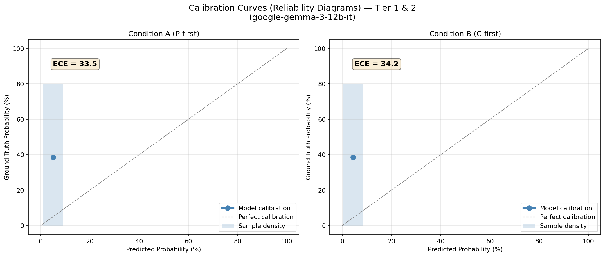

**MAE (Cond A):** 34.25 | **MAE (Cond B):** 34.69

> **Both models are poorly calibrated.** MAE ~34–35 on a 0–100 scale is near-chance performance (random uniform baseline ≈33). Both models have a systematic bias: they tend to predict very low probabilities (0–9% range) regardless of the true answer. The logit argmax distribution is heavily skewed toward low values (Qwen3-8B mean=3.3, Gemma mean=5.1), while many ground truth probabilities span the full range. Calibration curves show no useful mapping — essentially flat or inverted.

---

### 2.3 Confidence vs. Entropy

Does a model's verbalized confidence correlate with the sharpness (entropy) of its logit distribution?

#### Qwen3-8B

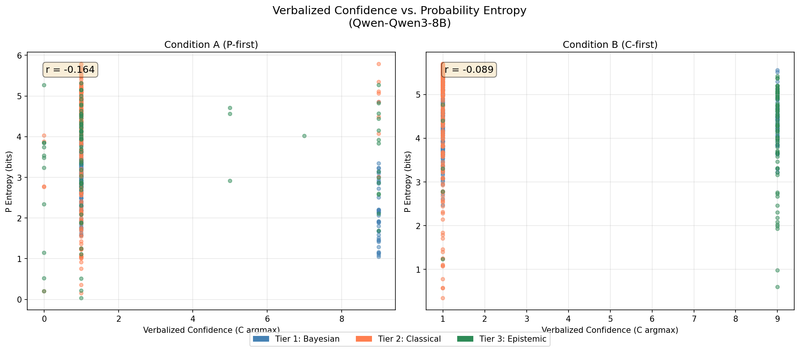

#### Gemma-3-12B

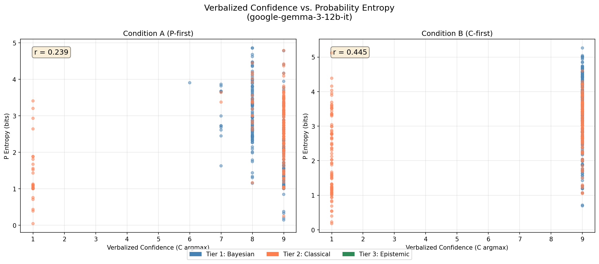

> **Key finding:** Both models show weak or near-zero correlation between stated confidence (C argmax) and P distribution entropy. High stated confidence does not reliably correspond to a sharper/more concentrated probability distribution. This is evidence of a **disconnect between verbalized uncertainty and internal distributional uncertainty** — a core finding of this work.

---

### 2.4 Modality Analysis

How many distinct peaks (modes) does the logit distribution have?

#### Qwen3-8B

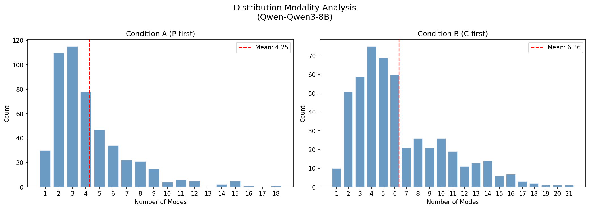

| Condition | Mean modes (P) |
|-----------|----------------|
| Cond A (P-first) | 4.25 |
| Cond B (C-first) | 6.36 |

#### Gemma-3-12B

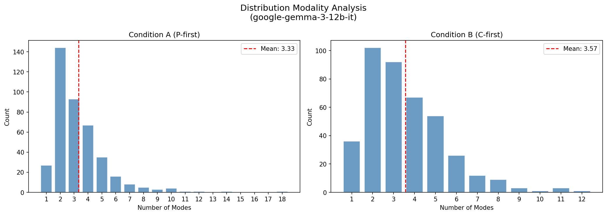

| Condition | Mean modes (P) |
|-----------|----------------|
| Cond A (P-first) | 3.33 |
| Cond B (C-first) | 3.57 |

> **Distributions are routinely multimodal.** Qwen3-8B averages ~4.25 modes per question in Cond A, rising to 6.36 in Cond B. This means the model is simultaneously placing meaningful mass on multiple numerically-distinct probability ranges. A single argmax number is a poor summary of the model's actual internal state.

---

### 2.5 Attractor Analysis

Do models cluster at psychologically "round" numbers (multiples of 5 or 10)?

#### Qwen3-8B

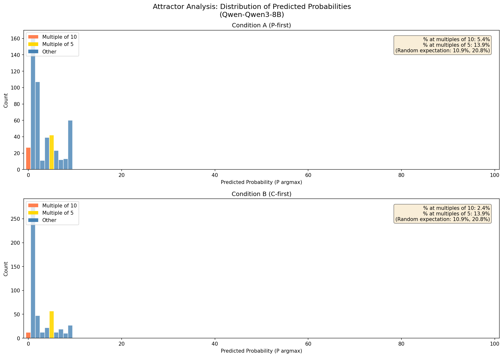

| Condition | % at ×10 | % at ×5 |
|-----------|-----------|---------|
| Cond A | 5.44% | 13.91% |
| Cond B | 2.42% | 13.91% |
| *Random baseline* | *10.9%* | *20.8%* |

#### Gemma-3-12B

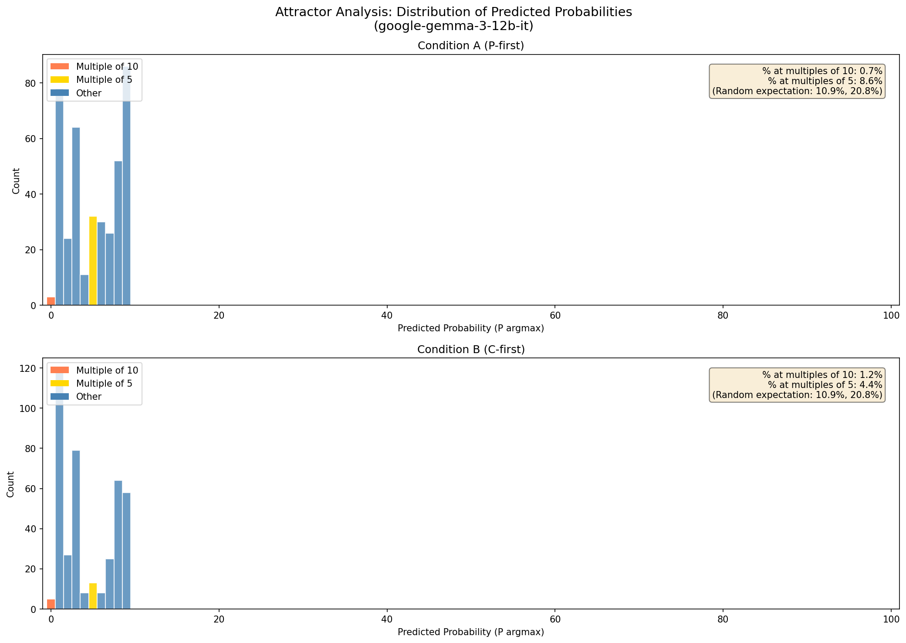

| Condition | % at ×10 | % at ×5 |
|-----------|-----------|---------|
| Cond A | 0.74% | 8.62% |
| Cond B | 1.23% | 4.43% |
| *Random baseline* | *10.9%* | *20.8%* |

> **Counter-intuitive finding: no round-number bias at logit level.** Both models cluster *below* the random expectation for multiples of 10 and 5. This is the opposite of what one might expect from human psychology or chain-of-thought behavior. The reason: both models strongly prefer very low digit tokens (0–9), so the argmax distribution is skewed toward single-digit numbers regardless of question type. The "attractor" here is not round numbers but rather *small* numbers.

---

### 2.6 Order Effects

KL divergence between conditions A and B measures how much the elicitation order changes the model's distribution.

#### Qwen3-8B

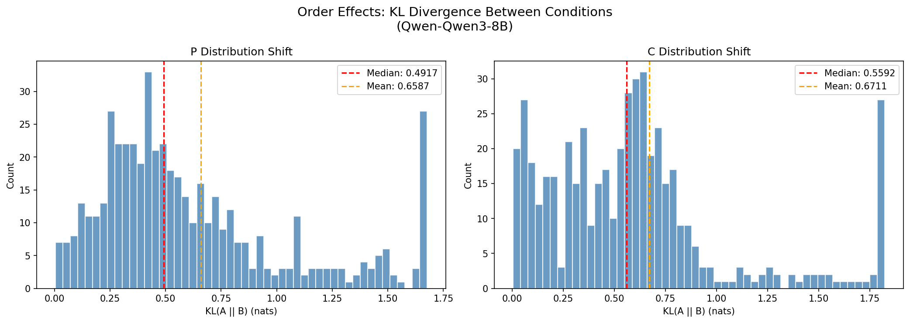

| Metric | Mean KL | Median KL |
|--------|---------|-----------|
| P distribution shift | 0.659 nats | 0.492 nats |
| C distribution shift | 0.671 nats | 0.559 nats |

#### Gemma-3-12B

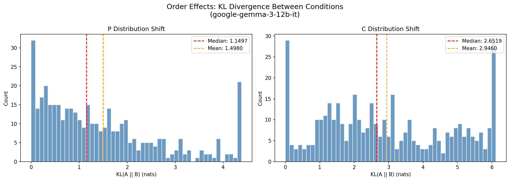

| Metric | Mean KL | Median KL |
|--------|---------|-----------|
| P distribution shift | 1.498 nats | 1.150 nats |
| C distribution shift | 2.946 nats | 2.652 nats |

> **Gemma shows 2–4× larger order effects than Qwen3.** Asking for confidence vs. probability first substantially reshapes the distribution, especially for C (confidence) in Gemma. This suggests Gemma's confidence outputs are highly sensitive to the framing of the prompt, while Qwen3-8B is more stable across elicitation order.

---

### 2.7 Calibration Error by Category

#### Qwen3-8B

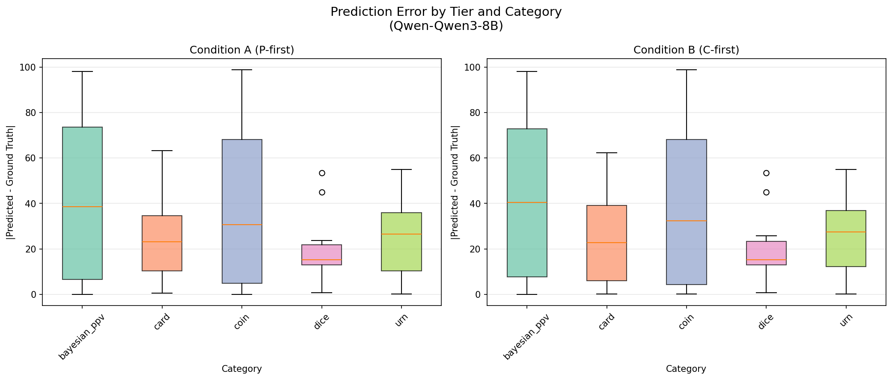

| Category | MAE Cond A | MAE Cond B |
|----------|------------|------------|
| bayesian_ppv | 41.13 | 41.79 |
| coin | 37.51 | 38.11 |
| urn | 24.52 | 24.94 |
| dice | 19.76 | 19.96 |
| card | 25.01 | 24.51 |

#### Gemma-3-12B

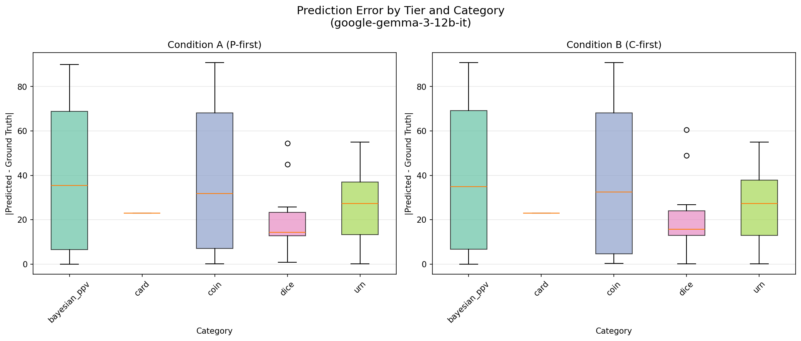

> **Bayesian inference is the hardest category** for both models (MAE ~38–42). Dice and urn problems are relatively better, possibly because the model has more training signal on small-number computations.

---

## 3. Cross-Model Comparison

### Entropy

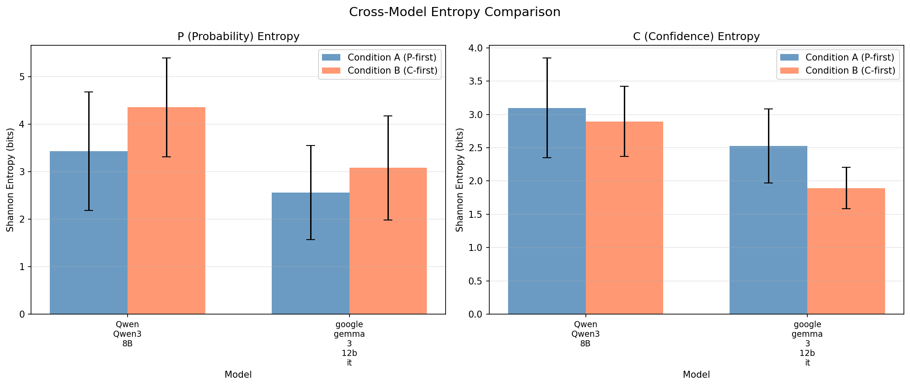

### Attractor Bias

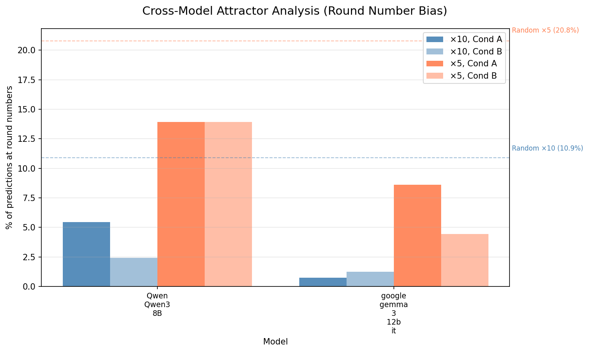

### Order Effects

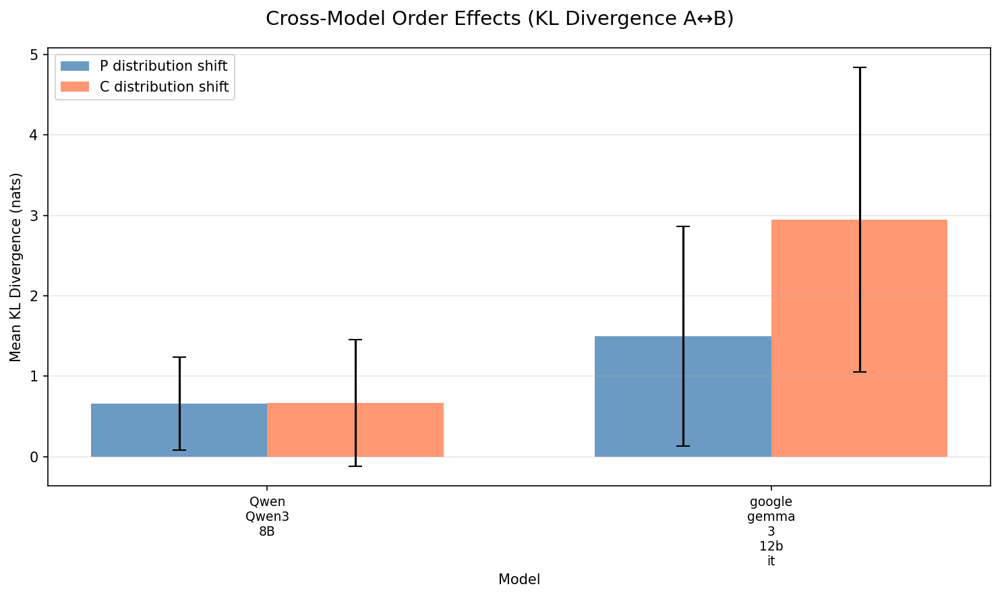

### Calibration Error

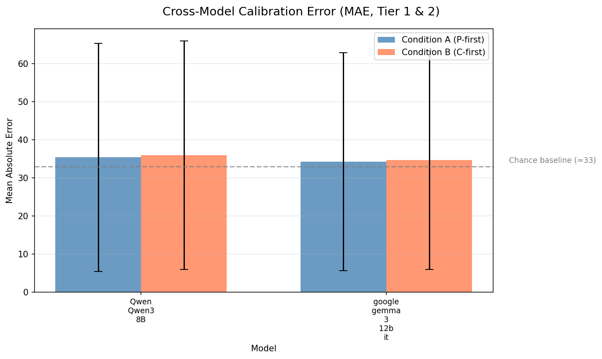

**Cross-model summary:**
- Gemma-3-12B has **lower entropy** overall (more peaked distributions)
- Gemma-3-12B has **larger order effects** (more sensitive to elicitation order)
- Both have nearly identical calibration error (MAE ~34–35)
- Neither model shows round-number attractor bias; Gemma shows less even than Qwen3

---

## 4. Summary of Findings

| Finding | Qwen3-8B | Gemma-3-12B |
|---------|----------|-------------|
| Mean P entropy (Cond A) | 3.43 bits | 2.56 bits |
| Mean P entropy (Cond B) | 4.35 bits | 3.08 bits |
| Mean modes per question (P, Cond A) | 4.25 | 3.33 |
| Calibration MAE (Cond A) | 35.4 | 34.2 |
| % predictions at ×10 (vs 10.9% random) | 5.44% | 0.74% |
| Mean order effect KL — P (nats) | 0.659 | 1.498 |
| Mean order effect KL — C (nats) | 0.671 | 2.946 |

### Core Conclusions

1. **LLMs are not calibrated at the logit level for numerical probability questions.** MAE ~34–35 is near-chance, suggesting the logit-level output contains little useful signal about the true probability.

2. **Distributions are routinely multimodal.** Using a single argmax as the model's "answer" discards most of the distributional information. Models maintain mass on 3–6 distinct probability ranges simultaneously.

3. **Verbalized confidence does not track logit entropy.** High stated confidence ≠ peaked distribution. These are loosely correlated at best.

4. **Elicitation order matters substantially.** Asking for confidence first increases the entropy of the subsequent probability estimate. The effect is 2–4× stronger in Gemma than Qwen3.

5. **No round-number attractor at logit level.** Both models have a strong *small-number* bias in their argmax (both means < 6), not a round-number bias. This may be an artifact of the multi-token logit reconstruction or a genuine preference for low-probability outputs.

---

## Appendix: Experimental Setup

See [README.md](../README.md) for full experimental design, dataset details, and logit extraction methodology.

See [literature_review.md](literature_review.md) for the citation chain: Guo 2017 → Kadavath 2022 → Mitchell 2023 → Xiong 2023 → Yang 2024 → this work.
